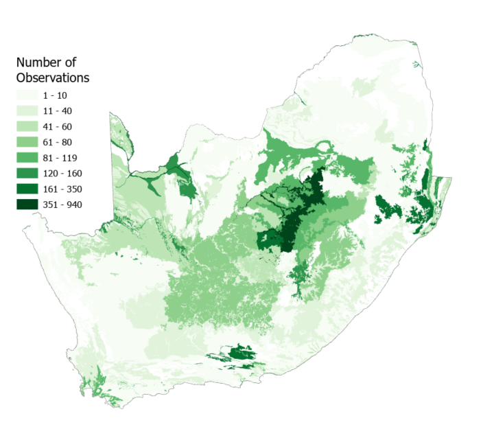
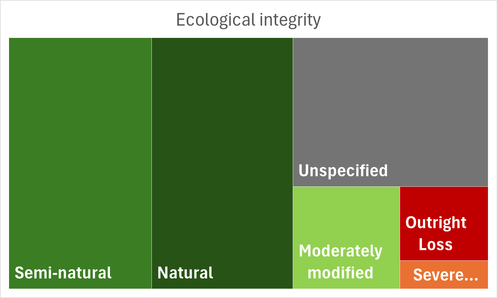

## 1. VEGMAP Project feedback:

::: panel-tabset
## Action items 2024/5

The table is an overview of the progress since November 2024. Note that items completed in 2024 have been archived and only ongoing items are reflected:

+---------------------------------------------------------------------------------------------------------------------------------------------------------+-------------------------+-----------------------------------------------------------------------------------------------------------------------------------------------------------------------------------------------------+
| | Description/actions                                                                                                                                   | Responsible person/s    | Progress                                                                                                                                                                                            |
+=========================================================================================================================================================+=========================+=====================================================================================================================================================================================================+
| A2\* Google Earth version of NVM 2024 for Coert.                                                                                                        | Anisha                  | ***Complete***. Files loaded onto Coert’s devices in April.                                                                                                                                         |
+---------------------------------------------------------------------------------------------------------------------------------------------------------+-------------------------+-----------------------------------------------------------------------------------------------------------------------------------------------------------------------------------------------------+
| A3\*Philip to submit a short motivation for the NW amendment                                                                                            | Philip                  | ***Complete**.* Philip submitted a motivation with a control sheet which was signed and appended to the original technical report.                                                                  |
+---------------------------------------------------------------------------------------------------------------------------------------------------------+-------------------------+-----------------------------------------------------------------------------------------------------------------------------------------------------------------------------------------------------+
| B5 \*Anisha to make two mock-ups of a poster using NVMC feedback                                                                                        | Anisha                  | ***Complete draft***: Worked with SANBI Interpretation Team. V2 shared with NVMC for comment.                                                                                                       |
+---------------------------------------------------------------------------------------------------------------------------------------------------------+-------------------------+-----------------------------------------------------------------------------------------------------------------------------------------------------------------------------------------------------+
| B7+B8 \*Add Phd project or research strategy: exploration of ecosystem types with a higher potential for change, and vegetation type classification key | Anisha                  | ***Complete***. Projects added to list.                                                                                                                                                             |
+---------------------------------------------------------------------------------------------------------------------------------------------------------+-------------------------+-----------------------------------------------------------------------------------------------------------------------------------------------------------------------------------------------------+
| D12 \*Possible KMs  to the NBA writing retreat.                                                                                                         | Andrew and Anisha       | ***Complete**.*                                                                                                                                                                                     |
+---------------------------------------------------------------------------------------------------------------------------------------------------------+-------------------------+-----------------------------------------------------------------------------------------------------------------------------------------------------------------------------------------------------+
| A2\* Harvest iNat images outside VEGMAPhoto, & follow up with expert stock images                                                                       | Anisha, Londiwe, Esethu | In Progress: We explored the AI Vision Language Demo in iNat as well as scrolling through all observations for SA and have tagged \>50 images so far to VEGMAPhoto                                  |
+---------------------------------------------------------------------------------------------------------------------------------------------------------+-------------------------+-----------------------------------------------------------------------------------------------------------------------------------------------------------------------------------------------------+
| B7 \*VEGMAP team to continue with Mozambique edge-matching.                                                                                             | Anisha, Mervyn, Andrew  | In Progress: mapping gaps and overlaps have been identified and project has been broke into P1: spatial fixes, P2: Classification harmonisation.                                                    |
+---------------------------------------------------------------------------------------------------------------------------------------------------------+-------------------------+-----------------------------------------------------------------------------------------------------------------------------------------------------------------------------------------------------+
| C10 \*Anisha to set up workshops to discuss EFGs crosswalks and SA functional groups with experts.                                                      | Anisha                  | In Progress: Presentation was made to Thicket Forum and AZEF in 2025. A workshop has been set for Thicket in January 2026                                                                           |
+---------------------------------------------------------------------------------------------------------------------------------------------------------+-------------------------+-----------------------------------------------------------------------------------------------------------------------------------------------------------------------------------------------------+
| C9 \*Set a date for Forest subtyping workshop, ID key participants and prepare an information pack.                                                     | Anisha                  | On hold: Coerts students working in areas that were identified as gaps by NVMC in 2023. Therefore workshop on hold until this work produces some data that may help us resolve the difficult areas. |
+---------------------------------------------------------------------------------------------------------------------------------------------------------+-------------------------+-----------------------------------------------------------------------------------------------------------------------------------------------------------------------------------------------------+

## Action items 2023/4

|                                  |
|----------------------------------|
| **Tasks from 2023 NVMC meeting** |

+---------------------------------------------------------------+----------------------------+---------------------------------------------------------------------------------------------------------------+
| | **Description/actions**                                     | | **Responsible person/s** | **Progress**                                                                                                  |
+---------------------------------------------------------------+----------------------------+---------------------------------------------------------------------------------------------------------------+
| B6 \*Share updated NW paper                                   | Philip                     | ***Complete.***                                                                                               |
+---------------------------------------------------------------+----------------------------+---------------------------------------------------------------------------------------------------------------+
| \- D11 \*Tak ethe RLE discussion to the local forums          | Maphale                    | ***Complete.***                                                                                               |
+---------------------------------------------------------------+----------------------------+---------------------------------------------------------------------------------------------------------------+
| A2 \*Explore options for iNat from Southern African countries | Anisha, Tony               | ***Complete.***                                                                                               |
+---------------------------------------------------------------+----------------------------+---------------------------------------------------------------------------------------------------------------+
| \* Explore VEGMAPhoto and Rapid10 Link                        | Anisha, Alastair           | ***Complete.*** Student appointed but later declined bursary                                                  |
+---------------------------------------------------------------+----------------------------+---------------------------------------------------------------------------------------------------------------+
| **\*** Calc search area for inclusion SAAFor reports**.**     | Sam, Thapelo               | ***Complete.***                                                                                               |
+---------------------------------------------------------------+----------------------------+---------------------------------------------------------------------------------------------------------------+
| A2 \* Set a date with NVMC to demonstrate iNat image upload   | Anisha, Kagiso             | In Progress: questionnaire was shared to see how many would like a workshop                                   |
+---------------------------------------------------------------+----------------------------+---------------------------------------------------------------------------------------------------------------+
| \* Update written instructions for VEGMPhoto for users        | Kagiso                     | In Progress: Update tutorial and instruction video for uploading CarryMap and iNat for people at conferences. |
+---------------------------------------------------------------+----------------------------+---------------------------------------------------------------------------------------------------------------+
| A3 \*TERG members to table and discuss names for group        | TERG                       | In Progress: Name under discussion but ‘VEGMAP Emerging Researchers Group’ has been tabled.                   |
+---------------------------------------------------------------+----------------------------+---------------------------------------------------------------------------------------------------------------+
| \*Explore standard drop-downs for certain fields              | Anisha and Kagiso          | On-going: This will be explored further when EDD is in a database.                                            |
+---------------------------------------------------------------+----------------------------+---------------------------------------------------------------------------------------------------------------+
| \- B8\* Facilitating partnerships with NVD contributors       | All                        | On-going: Committee members have assisted resulting in signed DSA’s                                           |
+---------------------------------------------------------------+----------------------------+---------------------------------------------------------------------------------------------------------------+
| \- B3\* Alastair to report on alternative names for Thicket   | Alastair                   | On-going: Alastair will keep us updated.                                                                      |
+---------------------------------------------------------------+----------------------------+---------------------------------------------------------------------------------------------------------------+
| \- Develop draft classification hierarchy-types vs. subtypes  | Tony Rebelo, VegMap team   | On-going: Tony and Anisha began initial discussions                                                           |
+---------------------------------------------------------------+----------------------------+---------------------------------------------------------------------------------------------------------------+
| \*Compare current functional groups Cowling 1998              | VEGMAP Team                | Little progress: Anisha to pursue later in the year                                                           |
+---------------------------------------------------------------+----------------------------+---------------------------------------------------------------------------------------------------------------+
| B3\* Flag veg types with multiple biome affinities            | Anisha and Alastair        | Little progress.                                                                                              |
+---------------------------------------------------------------+----------------------------+---------------------------------------------------------------------------------------------------------------+
:::

::: {.callout-tip style="background-color:#F4F4DB; border-left:6px solid #228B22;"}
## Other ongoing tasks

+------------------------------------------------------------------------------------------------------------------------------------------------------------------------------------------------------------------------------------------------------------------------------------------------------------------------------------------------------------------------------------------------------------------------------------------------------------------------------------------------------------------------------------------------------------------------------------+
| 2024: Coert to share the names and titles of his students theses to add to the VEGMAP research projects list, 2023: Follow up with NGI for high-res imagery, P1\* Follow-up VEGMAPhoto on iNaturalist arid landscape photos., Identify priority areas where the VegMap needs to be strengthened and refined, A4 Actions: \*Going forward add a reference date for all forest polygons captured for future versions of NVM, Refine Functional Vegetation Group/Functional models for vegetation types, increase the profile of the vegetation map, Sign NVD data sharing agreements |
+------------------------------------------------------------------------------------------------------------------------------------------------------------------------------------------------------------------------------------------------------------------------------------------------------------------------------------------------------------------------------------------------------------------------------------------------------------------------------------------------------------------------------------------------------------------------------------+
:::

------------------------------------------------------------------------

#### **2. VEGMAPhoto (s Afr) Project on iNaturalist update:**

We have collected observations for 327 vegetation types across the country so far, 26 more since our last update. Please have a look at Kagiso’s latest blog post for more information by clicking on the image below. The project proved its worth as we were able to select landscape images from VEGMAPhoto for the Poster, the NBA terrestrial ecosystem webpage as well as various presentations through the year. Therefore it is becoming a valuable resource.

[{width="579"}](https://www.inaturalist.org/posts/119810-vegmaphoto-s-afr-progress-report-november-2025)

About 75% of these observations have the ecological integrity field populated. The majority of the \>7000 observations are from natural and semi-natural localities.

{width="523"}

Following Tony's advice, we have tagged several landscape images on iNat to the project by scrolling through the observations in South Africa. We are looking into a more efficient way to do this.

------------------------------------------------------------------------

#### **3. Mapping and classification update:**

BGIS has uploaded a map viewer for NVM 2024 that can be accessed [here](https://bgisviewer.sanbi.org/Html5Viewer/Index.html?configBase=https://bgisviewer.sanbi.org/Geocortex/Essentials/REST/sites/2024_National_Vegetation_Map/viewers/2024_NVM_Final/virtualdirectory/Resources/Config/Default). The following mapping and classification work has been identified for future proposals in the coming years. This includes new information, existing information from older maps, or work emerging from our students:

::: {.panel-tabset style="background-color:#A6C875"}
## Proposals ready for review

######      Mapping proposals: {style="colour: purple"}

1.  [Eastern Little Karoo:]{.underline} Annelise and Jan Vlok noted that a few polygons of Eastern Little Karoo that should be reassigned to Willowmore Gwarrieveld and North Kammanassie Sandstone Fynbos. We have prepared a proposal for consideration by the NVMC.

    ###### Ecosystem description and definition Proposals: {style="colour: purple"}

    2.  The community paper by Sithole et al has been used to populate a first draft of a description of Gd6 based on a template previously circulated to the NVMC for comment. The draft community descriptions whic will be used as an example for future descriptions is circulated to the NVMC for comment.

## Proposals in progress

###### Mapping proposals:

1.  [Bushmanland Inselberg Shrubland]{.underline}: 19 inselbergs mapped north of Springbok mapped by Laetitia Osborne based on plots she sampled in field. We will relook at these polygons and send to the NVMC to review.

2.  [Possible Forest/Riparian areas in Duiwenhoks]{.underline}: Data points sent through by Stehan Goets to be investigated with Coert.

3.  [Southern Afrotemperate Forest]{.underline}: Refined mapping by 2023 interns needs to be reviewed. Interns used georeferenced historical imagery for this mapping like we did with the mangroves for NVM 2024.

    ###### Classification and hierarchy:

    4.  National Forest types work is ongoing with Coert Geldenhuys and will be discussed with the NVMC later this year.
:::

#### **4. Terrestrial Emerging Researchers Group update:**

Several of our emerging researchers have some exciting news. Below is an update on some of our members. Apologies if I have missed anyones good news. Please keep us updated if you have anything to share:

+------------------+-------------+-------------------------------------------------------------+--------------------------+-----------------------------------------------------------------------------------------------+
| Name             | Institution | Research Area                                               | Outcome                  | Next steps                                                                                    |
+==================+=============+=============================================================+==========================+===============================================================================================+
| Jubilant Sithole | UFS         | Drakensberg-Amathole Afromontane Fynbos (Gd 6) refinement   | GRADUATED                | Registered for Phd in Gd6 looking at effects of fire on communities, drafting papers from MSc |
+------------------+-------------+-------------------------------------------------------------+--------------------------+-----------------------------------------------------------------------------------------------+
| Thapelo Kgomo    | Wits        | Communities and fire in FRg3 Robertson Granite Renosterveld | GRADUATED                | Working at SAEON as an ecological support technician, drafting papers from MSc                |
+------------------+-------------+-------------------------------------------------------------+--------------------------+-----------------------------------------------------------------------------------------------+
| Kagiso Mogajane  | SANBI       | RA ends in December 2026                                    | Received bursary for MSc | Just received a bursary for MSc with SANBI on ecological condition                            |
+------------------+-------------+-------------------------------------------------------------+--------------------------+-----------------------------------------------------------------------------------------------+
| Joshua Giddy     |             |                                                             |                          |                                                                                               |
+------------------+-------------+-------------------------------------------------------------+--------------------------+-----------------------------------------------------------------------------------------------+

In addition, some of our interns are co-authors on a popular article profiling past emerging scientists associated with VEGMAP and the version submitted to the CREW newsletter can be read [[here]{.underline}](https://drive.google.com/file/d/12SGSIAx2K9ZfFadL1qhuiTFaUHf7cZV2/view?usp=sharing "click here to read a draft of the article").

------------------------------------------------------------------------

#### **5. Progress on regional and global projects:**

1.  **SBAPP:** Namibia has launched the first version of their terrestrial ecosystem map. You may watch the press release [[here]{.underline}](https://www.youtube.com/watch?v=gCm5B5rc_Fo) and access the map [[here]{.underline}](https://zenodo.org/records/17218337)

2.  **IUCN-GET crosswalk review meetings with experts:** The VEGMAP Team spent the first half of the reporting period road showing NVM2024 and inviting experts to comment/review the IUCN crosswalk. a [[crossreference guideline]{.underline}](chrome-extension://efaidnbmnnnibpcajpcglclefindmkaj/https://portals.iucn.org/library/sites/library/files/documents/2025-026-En.pdf) was published earlier this year and a workshop to reivew the thicket crossreferencing has been set up for January 2026.

3.  **Global Ecosystems Atlas**: The GEO team appointed Falko Buscke, a south African ecologist who has continued to work with us to connect him with collaborators known to us to help build ecosystem maps in the region. The final first version is due to be published online and will include some SBAPP maps.

4.  **National Biodiversity Assessment**: The National Biodiversity Assessment will be launched on the 9th of December 2025 and will include an updated treat status for terrestrial ecosystem types.

------------------------------------------------------------------------

#### **6. Articles/products:**

1.  Published: Jubilant Sithole masters paper on plant communities in Gd6, [[published in Koedoe]{.underline}](https://koedoe.co.za/index.php/koedoe/article/view/1857)

2.  In production: NVM2024 beta updates paper, version contributors and reviewers will be invited for co-authorship.

3.  In production: Thapelo Kgomo masters paper on fire relative to plant communities in Robertson Granite Renosterveld.

------------------------------------------------------------------------

#### **7. NVD plot data transfer into BRAHMS and Data sharing agreements:**

Little progress on data sharing agreements. Kagiso has obtained new references to capture for inclusion in the NVD. In an effort to manage areas to focus on for the signing of Data Sharing Agreements we have plotted the locality of signed DSA's spatially. We hope to use this spatially explicit mapping of NVD projects to find projects that may be related to data owners working in specific areas to help us trace NVD projects without an author assigned (more than 60% of projects) in the spreadsheet we have inherited.

#### **8. Next feedback period and Annual meeting 2026**

Next feedback report: Mid year 2026

2026 will mark the 20th anniversary of the 2006 terrestrial map and classification system. Plans are in place to mark this milestone in small ways with a limited budget and will be discussed at NVMC 2026 in November.
